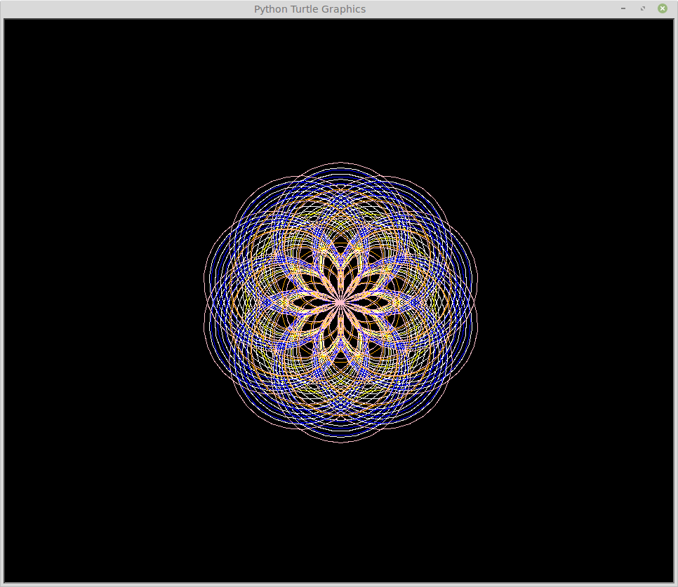
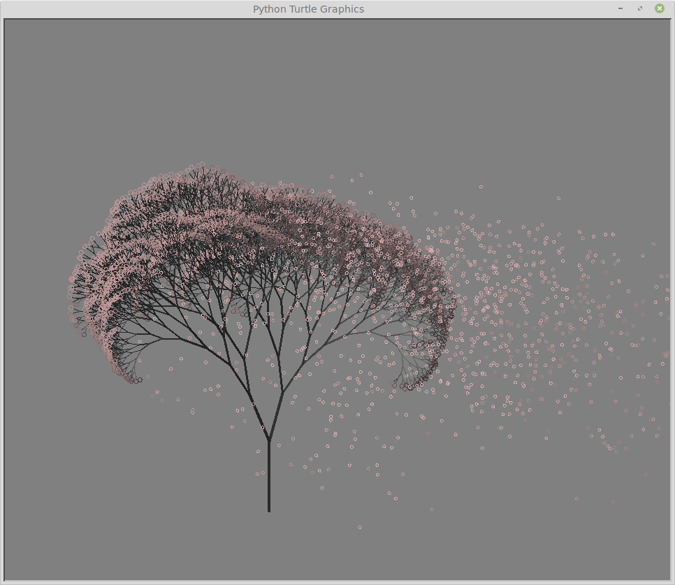
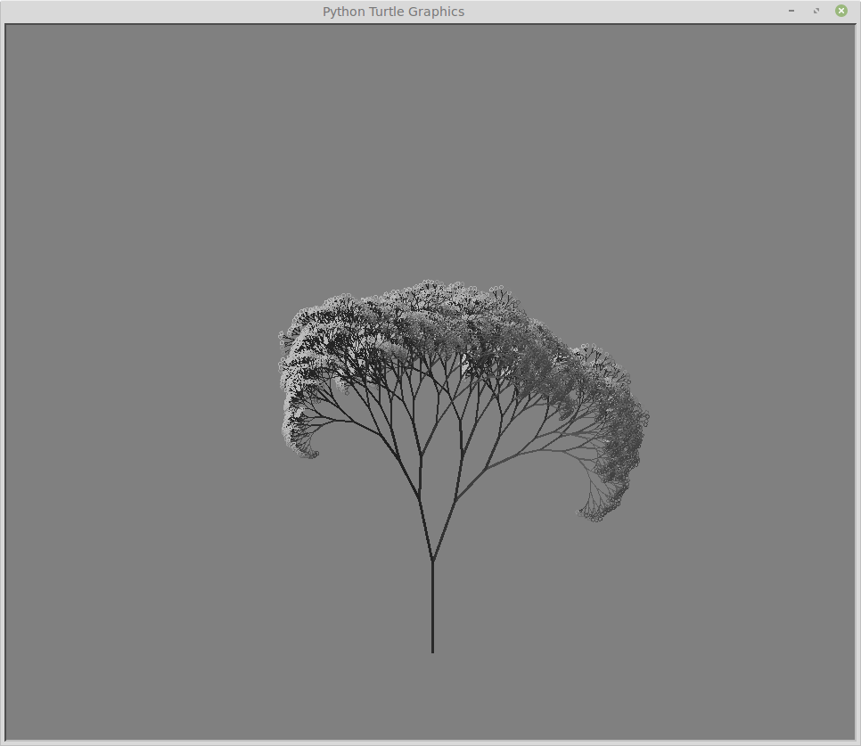
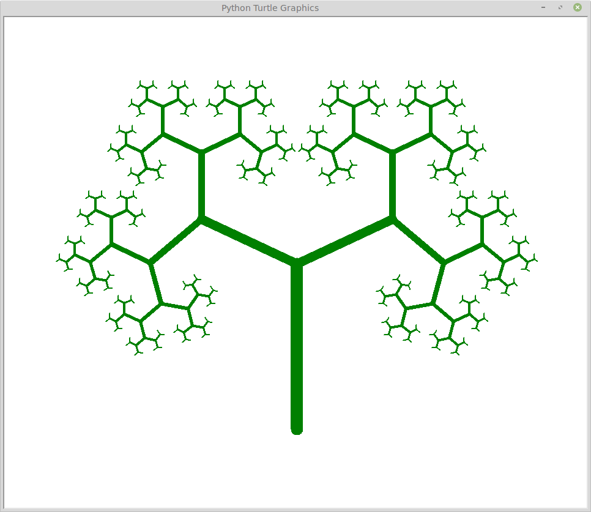
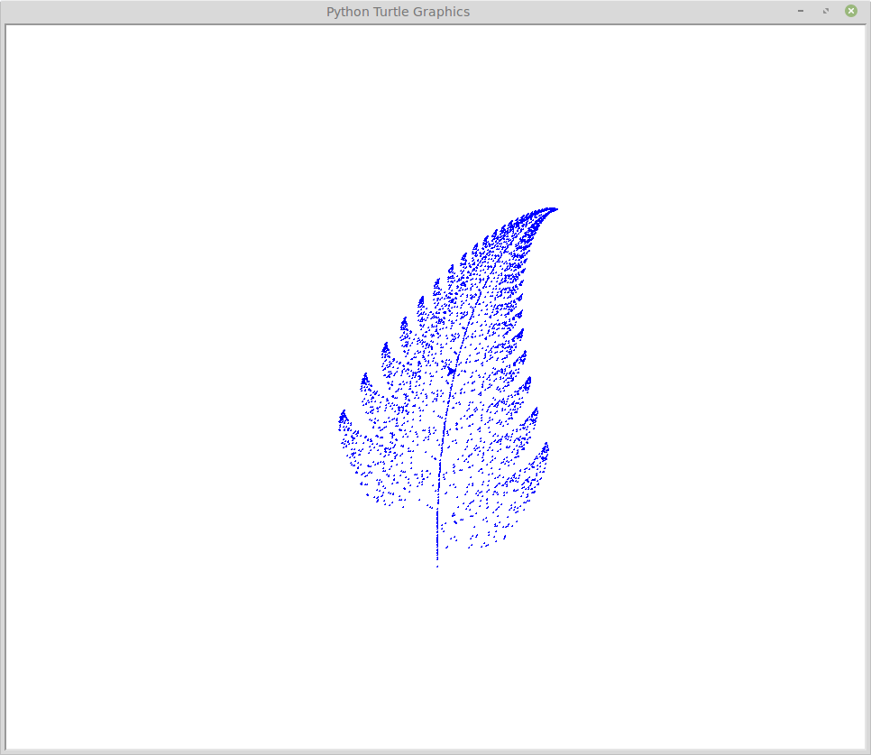

# PythonGraphics

## Description

Multiple small graphic design projects using Python libraries such as Turtle and NumPy. For fun and training purposes.

## Requirements

* Python3
* Turtle
* NumPy

## Gallery

